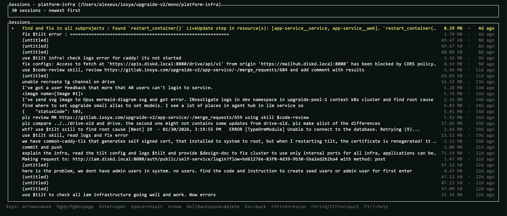
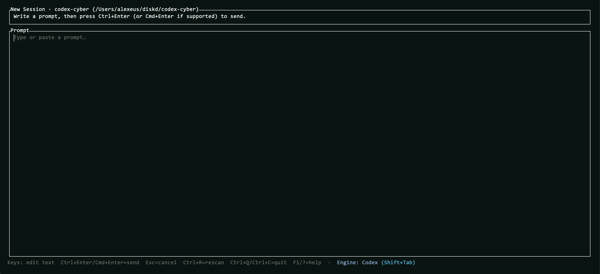

# ccbox

Rust TUI “box” for managing coding-agent sessions (Codex + Claude): browse local session logs now, and later reconstruct exactly what the agent did (files, tools, tokens).

## Status

Prototype features:
- Full-screen **Projects** → **Sessions** → **Session Detail** timeline
- “Online” dot (`●`) for recently modified projects/sessions
- Delete project/session logs with confirmation
- New Session prompt editor (`n`) that spawns Codex/Claude in the background
- Processes screen (`P`) for stdout/stderr/log viewing + killing spawned agents
- Auto-rescans when the sessions directory changes (file watcher)

## Install

Quick install from GitHub Releases (macOS/Linux):
```sh
/bin/bash -c "$(curl -fsSL -H 'Cache-Control: no-cache' https://raw.githubusercontent.com/diskd-ai/ccbox/main/scripts/install.sh)"
```

Homebrew (recommended):
```sh
brew tap diskd-ai/ccbox
brew install ccbox
```

From source:
```sh
git clone https://github.com/diskd-ai/ccbox.git
cd ccbox
cargo install --path .
```

## Screenshots

### Projects


What’s happening / features:
- Browse all discovered projects under your sessions directory.
- Type to filter; `Esc` clears.
- `●` indicates a recently modified (“online”) project.

### Sessions



What’s happening / features:
- Browse sessions for the selected project and open them with `Enter`.
- `Space` jumps to the newest “last Out” result.
- Delete logs with `Del`/`Backspace` (with confirmation).

### Session Detail (timeline)


What’s happening / features:
- Timeline view of the session: messages, outputs, and other events in order.
- `Enter` toggles expanded details; `c` adjusts the visible context window.
- `o` copies/opens the last “Out” result quickly.

### New Session



What’s happening / features:
- Paste/edit a prompt, then spawn Codex/Claude in the background.
- `Shift+Tab` switches engine; `Ctrl+Enter`/`Cmd+Enter` sends.

## Roadmap

1. Manage spawned sessions (processes) and their lifecycle.
2. Manage a tasks queue and assign tasks to an engine (Codex/Claude).
3. Support multi-session workflows (handoffs, context carry, session grouping).
4. Manage Ralph loops.
5. Loops planning and task decomposition routines.
6. Remote control via channels:
   - JSON-RPC
   - Telegram
   - Slack
   - WhatsApp
   - Email

## Run

```bash
cargo run
```

Optional overrides:
- `CODEX_SESSIONS_DIR` (defaults to `$HOME/.codex/sessions`)

Notes:
- Spawning sessions requires `codex` on your `$PATH` (and `claude` if you switch engines).

## Keybindings (prototype)

- Global: `Ctrl+R` rescan · `P` processes · `F1`/`?` help · `Ctrl+Q`/`Ctrl+C` quit
- Lists: arrow keys move selection · `PgUp`/`PgDn` page
- Projects: type to filter · `Esc` clears filter · `Enter` opens · `Space` result (newest session) · `Del` delete (confirm)
- Sessions: `Enter` opens · `Space` result (last Out) · `n` new session · `Del`/`Backspace` delete (confirm) · `Esc` back
- New Session: edit/paste · `Ctrl+Enter`/`Cmd+Enter` send · `Shift+Tab` switch engine · `Esc` cancel
- Session Detail: `Enter` toggles details · `o` result (last Out) · `c` visible context window · `Esc`/`Backspace` back
- Processes: `s` stdout · `e` stderr · `l` log · `k` kill · `Enter` opens session (Codex only)

## License

MIT. See `LICENSE`.
