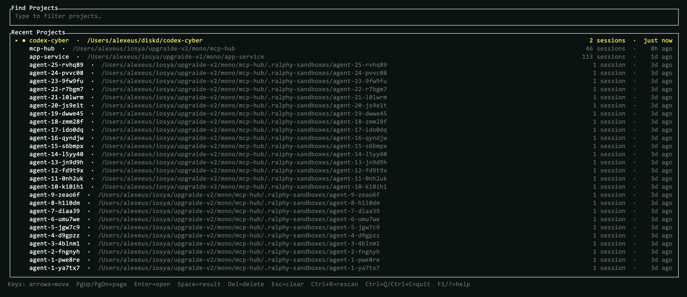
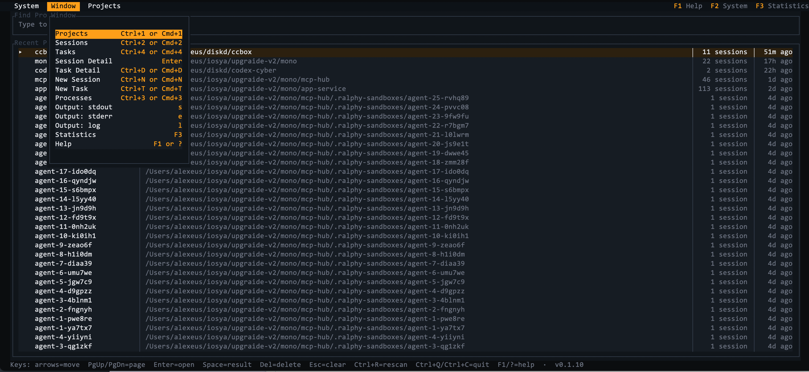
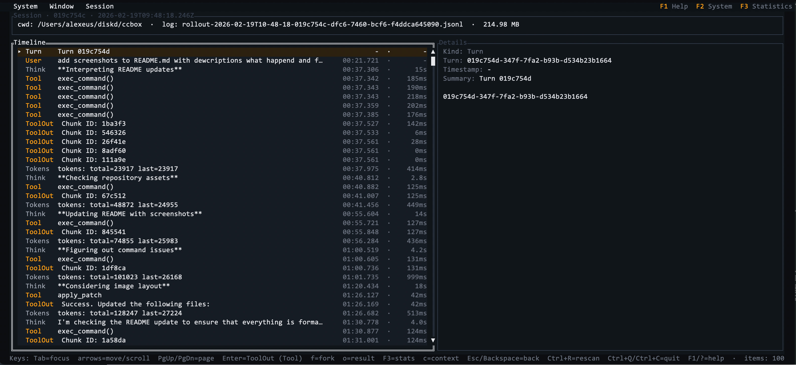

# ccbox

Rust TUI “box” for managing coding-agent sessions (Codex + Claude + Gemini): browse local session logs now, and later reconstruct exactly what the agent did (files, tools, tokens).

## Status

Prototype features:
- Full-screen **Projects** → **Sessions** → **Session Detail** timeline
- “Online” dot (`●`) for recently modified projects/sessions
- Delete project/session logs with confirmation
- New Session prompt editor (`n`) that spawns Codex/Claude in `Pipes` or `TTY` mode
- Processes screen (`P`) for stdout/stderr/log viewing + killing spawned agents
- Attach/detach to spawned `TTY` sessions (`a` to attach, `Ctrl-]` to detach)
- Auto-rescans when the Codex sessions directory changes (file watcher)

## Install

Quick install from GitHub Releases (macOS/Linux):
```sh
/bin/bash -c "$(curl -fsSL -H 'Cache-Control: no-cache' https://raw.githubusercontent.com/diskd-ai/ccbox/main/scripts/install.sh)"
```

Homebrew (recommended):
```sh
brew tap diskd-ai/ccbox
brew install ccbox
```

From source:
```sh
git clone https://github.com/diskd-ai/ccbox.git
cd ccbox
cargo install --path .
```

## Screenshots

### Projects



What’s happening / features:
- Browse projects discovered from your local Codex/Claude/Gemini session logs.
- Type to filter (matching text is highlighted); `Esc` clears.
- Shift+Arrows multi-select; `Del` deletes selected (with confirmation).
- Project table includes path, session count, and last modified time; `●` indicates a recently modified (“online”) project.

### Menu bar



What’s happening / features:
- `F2` opens the menu; arrows/Enter (and mouse) navigate.
- The Engine menu (Projects/Sessions) filters by agent engine: All/Codex/Claude/Gemini.
- The Window menu provides shortcuts to every screen.

### Session Detail (timeline)



What’s happening / features:
- Timeline shows session events in order; details are always expanded.
- `Tab` switches focus (focused pane uses a double border); scrollbars indicate overflow.
- `Enter` jumps Tool → ToolOut; `o` previews the last Out; `F3` opens statistics.

### Session actions (fork/resume)


What’s happening / features:
- Fork/resume Codex from a selected Turn/User/Out/ToolOut record.
- Toggle Visible Context for the current turn.

### Session stats


What’s happening / features:
- Time spent, token usage, tool-call breakdown (success/error/unknown), and `apply_patch` changes.

### Tasks


What’s happening / features:
- Type to filter; `n` creates; `Ctrl+Enter` spawns; Shift+Tab switches engine.

### Processes


What’s happening / features:
- View output (`s`/`e`/`l`), kill (`k`), attach (`a`), and open the related session.

## Roadmap

See `ROADMAP.md`.

## Run

```bash
ccbox
```

CLI mode (no TUI):

```bash
ccbox projects
ccbox sessions                     # defaults to current folder (or a parent folder) project
ccbox sessions "/path/to/project"
ccbox history                      # defaults to latest session in current folder project
ccbox history "/path/to/session.jsonl"
ccbox history "/path/to/session.jsonl" --full
ccbox sessions --limit 50 --offset 0 --size
ccbox history --limit 200 --offset 0 --full --size
ccbox update
```

CLI details:
- Auto-selects the project for the current folder (or nearest parent) when `project-path` is omitted.
- Pagination: `sessions` and `history` default to `--limit 10`; use `--limit N` and `--offset N`.
- `projects` output: `project_name<TAB>project_path<TAB>session_count`
- `sessions` output: `started_at_rfc3339<TAB>session_id<TAB>title<TAB>log_path` (newest-first; `--size` adds `file_size_bytes` before `log_path`)
- `history` accepts a session `.jsonl` path or a **project directory**; if a directory is provided it selects that project’s latest session.
- `history` prints a readable timeline; `--full` includes long details (tool calls/outputs, full messages); `--size` prints stats to stderr.
- Pipe-friendly output (handles broken pipes like `ccbox history | head`).
- Parse warnings and “truncated” notices are printed to stderr.
- On TUI start, `ccbox` checks for a newer GitHub Release in the background and shows a hint if one is available.

Optional overrides:
- `CODEX_SESSIONS_DIR` (defaults to `~/.codex/sessions`; Windows: `%USERPROFILE%\\.codex\\sessions`)
- `CLAUDE_PROJECTS_DIR` (defaults to `~/.claude/projects`)
- `CCBOX_GEMINI_DIR` (defaults to `~/.gemini`; sessions are discovered from `tmp/<project-hash>/chats/session-*.json`)

Notes:
- Spawning sessions requires `codex` on your `$PATH` (and `claude` if you switch engines).

## Skill (skills.sh)

This repo ships an agent skill named `ccbox` that teaches Codex/Claude/Gemini how to inspect local session logs using the `ccbox` CLI (`projects`, `sessions`, `history`).

Install it:

```bash
npx skills add diskd-ai/ccbox --skill ccbox --global --yes
```

Make it available to your agent (one-time). If your agent already reads `~/.agents/skills`, you can skip this:

```bash
# Codex CLI
mkdir -p ~/.codex/skills
ln -s ~/.agents/skills/ccbox ~/.codex/skills/ccbox

# Claude Code
mkdir -p ~/.claude/skills
ln -s ~/.agents/skills/ccbox ~/.claude/skills/ccbox

# Gemini CLI
mkdir -p ~/.gemini/skills
ln -s ~/.agents/skills/ccbox ~/.gemini/skills/ccbox
```

Requirements: `ccbox` on your `$PATH` and access to your sessions directory (`CODEX_SESSIONS_DIR` if needed).

Example prompts:

- Codex: `codex "Use the ccbox skill to summarize the latest session for this repo."`
- Claude: `claude "Use the ccbox skill to summarize the latest session for this repo."`
- Gemini: `gemini "Use the ccbox skill to summarize the latest session for this repo."`

## Keybindings (prototype)

- Global: `Ctrl+R` rescan · `F2` system menu · `P` processes · `F1`/`?` help · `Ctrl+Q`/`Ctrl+C` quit
- Mouse: wheel scrolls lists/outputs/details · left click selects/focuses
- Lists: arrow keys move selection · `PgUp`/`PgDn` page
- Projects: type to filter · `Esc` clears filter · `Enter` opens · `Space` result (newest session) · `Del` delete (confirm)
- Sessions: `Enter` opens · `Space` result (last Out) · `n` new session · `Del`/`Backspace` delete (confirm) · `Esc` back
- New Session: edit/paste · `Ctrl+Enter`/`Cmd+Enter` send · `Shift+Tab` switch engine · `F4` switch `Pipes`/`TTY` · `Esc` cancel
- Session Detail: `Enter` ToolOut (Tool call) · `f` fork/resume (Codex) · `o` result (last Out) · `c` visible context window · `Esc`/`Backspace` back
- Processes: `a` attach (TTY) · `Ctrl-]` detach · `s` stdout · `e` stderr · `l` log · `k` kill · `Enter` opens session (Codex only)

## License

MIT. See `LICENSE`.
